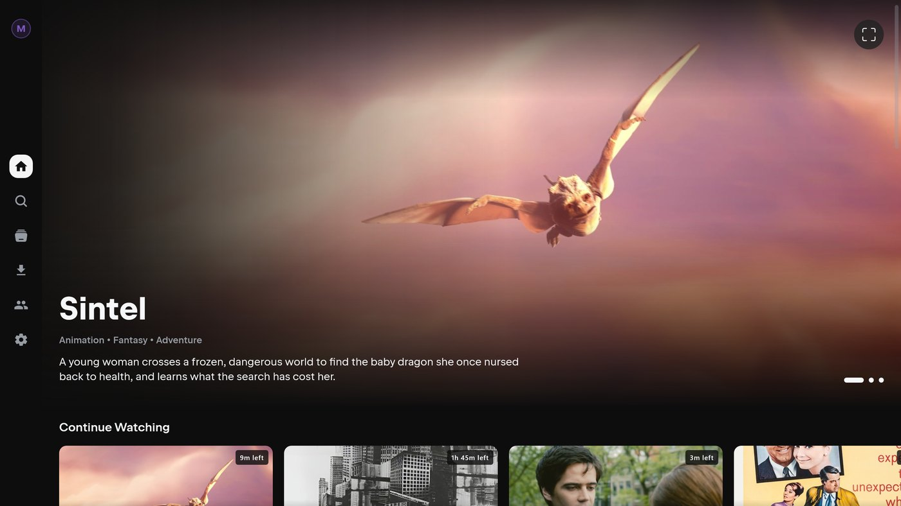
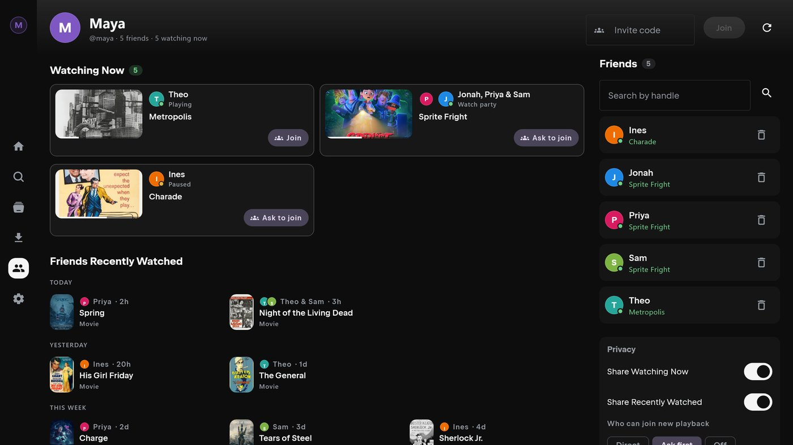
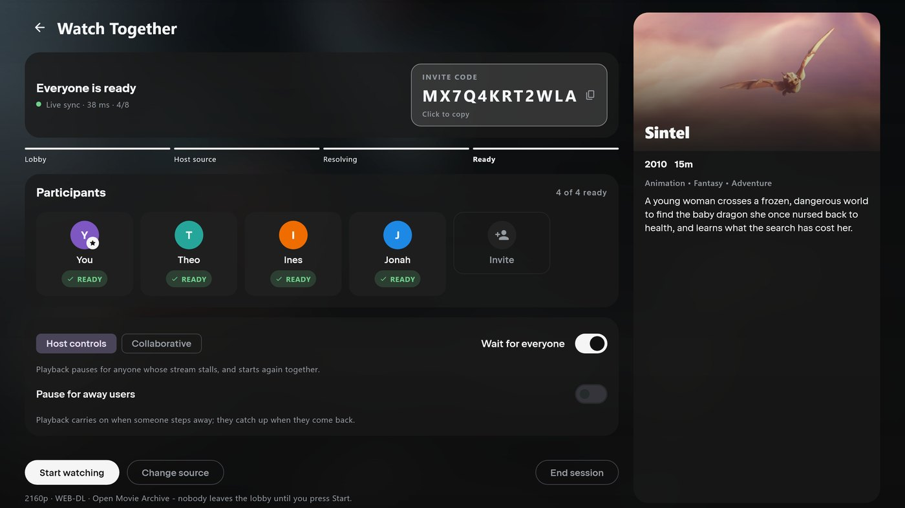

<div align="center">

  
  <br />
  <br />

  [![Contributors][contributors-shield]][contributors-url]
  [![Forks][forks-shield]][forks-url]
  [![Stargazers][stars-shield]][stars-url]
  [![Issues][issues-shield]][issues-url]
  [![License][license-shield]][license-url]

  <p>
    <b>Nuvio Z Desktop</b> is a community-maintained mod of
    <a href="https://github.com/NuvioMedia/NuvioDesktop">Nuvio Desktop</a> for Windows and macOS,
    with its own playback modes, rebuilt Downloads, Social and Watch Together.
    <br />
    <i>Looking for Android or iPhone? See <a href="https://github.com/Zokaper/nuvio-z">Nuvio Z Mobile</a>.</i>
  </p>

</div>

## What is Nuvio Z?

[Nuvio](https://github.com/NuvioMedia/NuvioDesktop) is a free, open-source media app from
NuvioMedia. You bring your own sources, and Nuvio turns them into a library with artwork, ratings,
subtitles and synced watch progress.

**Nuvio Z is a mod built on top of Nuvio.** It keeps the Nuvio you already know, follows
upstream's releases, and adds a set of features, workflows and fixes of its own. This repository is
the Windows and macOS app. The [Android and iPhone
app](https://github.com/Zokaper/nuvio-z) is built to feel like the same product on a phone, so a
profile you set up on one is at home on the other.

- **It's Nuvio underneath.** Everything Nuvio Desktop ships arrives by inheritance, and every Nuvio
  Z release names the Nuvio release it was built on. *Nuvio Z Desktop 0.1.26-alpha-z1 is built on
  Nuvio Desktop 0.1.26-alpha.*
- **Z adds its own things.** Playback modes that choose a source for you, a rebuilt Downloads
  system with offline playback, Social and Watch Together, and a redesigned setup. The full list
  is in [`Docs/Z-FEATURES.md`](https://github.com/Zokaper/nuvio-z/blob/main/Docs/Z-FEATURES.md).
- **It's a separate app.** Nuvio Z installs next to Nuvio rather than over it, and keeps its own
  sign-in on a computer that has both.
- **It isn't official.** Nuvio Z is not affiliated with or endorsed by NuvioMedia. If you hit a
  bug, report it here, not to upstream, unless you can reproduce it in Nuvio Desktop itself.

> **Desktop is still alpha.** Nuvio Desktop is still labelled alpha upstream, and so is Nuvio Z
> Desktop. Expect rough edges, and please report what you find.

## Install

Download the installer for your computer from the
[latest release](https://github.com/Zokaper/NuvioZDesktop/releases/latest).

| Platform | File |
| --- | --- |
| **Windows** (x64) | `Nuvio-Z-Windows-x64-….msi` |
| **macOS**, Apple Silicon (M1 and later) | `Nuvio-Z-macOS-arm64-….dmg` |
| **macOS**, Intel | `Nuvio-Z-macOS-x86_64-….dmg` |

- **Windows:** run the MSI.
- **macOS:** open the DMG and drag Nuvio Z into Applications. The DMGs aren't signed or notarized
  yet, so the first time, right-click the app and choose *Open*, or allow it in *System Settings →
  Privacy & Security*.
- **Linux:** there's no Linux build for now.

Nuvio Z checks GitHub Releases for new versions from inside the app. On Windows an update installs
in place and reopens Nuvio Z. Each release also lists checksums in `SHA256SUMS.txt`.

## Features

**Playback that does the picking.** Choose how much you want to be asked. *Classic* shows every
source and lets you choose. *Streamlined* asks one question, what quality you want, and picks the
best release in it. *Instant* asks nothing: it checks your connection and plays what it can
actually carry. The quality picker is built from the releases a title really has, and a loading
screen shows what's happening and moves to the next source on its own if one fails. Right-click a
title or episode for the full source list in any mode. Picture-in-Picture keeps the player on top
while you do something else.

**Downloads that work offline.** Download a movie, an episode or a whole season in *Automatic*,
*Assisted* or *Manual* mode, with size levels shown in GB per hour so you know what a season will
cost before it starts. A *Needs you* list says what's stuck and offers the fix. Downloaded titles
become a library that plays with no connection at all, and files land in tidy `Title / Season`
folders. Run one to four downloads at once.

**Social.** Add friends by handle, see what they're watching now and what they recently finished,
and ask to join with one click. You choose what friends can see, and the whole thing is opt-in:
turn Social off and the tab, the rows and Watch Together go away.

**Watch Together.** Start a party from whatever you're playing and watch in sync with friends on
another computer, or on [Android or iPhone](https://github.com/Zokaper/nuvio-z). Everyone plays through
their own sources, so nobody shares an account or a link. The host can keep control or share it,
and can choose to wait for anyone who has stepped away.

**Setup and personalization.** First-time setup walks you through playback, downloads, language,
sources and Social, with a live preview of what each choice changes. If you don't have a source
yet, it can set up a recommended AIOStreams + TorBox one. *Advanced Setup* covers everything else
and can be reopened any time. Shared profile preferences follow you between devices, while
device-specific ones, like navigation style, are set up on each device. Choose between a top bar
and a sidebar, and decide which settings you see.

**Tracking and metadata.** MDBList for watched history, library and Rotten Tomatoes scores. Cast,
artwork and episode details from TMDB out of the box. Credits skipping, subtitle choices that
carry to the next episode, custom poster images (advanced).

**Sources.** Nuvio Z does not provide content. You add sources, the same Stremio-style addons Nuvio
uses, and Nuvio Z ranks and plays what they return.



| | |
| --- | --- |
|  |  |

<sub>Screenshots are renders of the app's real screens with sample content. Artwork is from freely
licensed films; credits are in [`Docs/images/readme/CREDITS.md`](./Docs/images/readme/CREDITS.md).</sub>

## Platforms

Nuvio Z is one product on two codebases, released separately.

| | Platforms | Repository |
| --- | --- | --- |
| **Desktop** (this repository) | Windows · macOS | [`Zokaper/NuvioZDesktop`](https://github.com/Zokaper/NuvioZDesktop) |
| **Mobile** | Android · iPhone | [`Zokaper/nuvio-z`](https://github.com/Zokaper/nuvio-z) |

Social and Watch Together work across mobile and desktop, so a party can mix a phone and a
computer.

## Development

```bash
git clone https://github.com/Zokaper/NuvioZDesktop.git
cd NuvioZDesktop
./gradlew :composeApp:run          # Windows PowerShell: .\gradlew.bat :composeApp:run
```

You need a JDK. On Windows, `.\scripts\dev-desktop.ps1 normal` finds the JetBrains Runtime that
ships with Android Studio or IntelliJ for you; the exact setup is in the development guide.

Hot Reload, the MCP workflow for AI agents, packaging, versioning and local-state notes are in
[`Docs/DEVELOPMENT.md`](./Docs/DEVELOPMENT.md). Please read [`CONTRIBUTING.md`](./CONTRIBUTING.md)
before opening an issue or pull request.

The documents that explain how the mod relates to Nuvio live in the mobile repository and cover
both: [`Z-FEATURES.md`](https://github.com/Zokaper/nuvio-z/blob/main/Docs/Z-FEATURES.md) (every Z
feature and the platforms it's on),
[`UPSTREAM.md`](https://github.com/Zokaper/nuvio-z/blob/main/Docs/UPSTREAM.md) (how Z tracks
upstream and is versioned) and
[`PATCH-SURFACE.md`](https://github.com/Zokaper/nuvio-z/blob/main/Docs/PATCH-SURFACE.md) (every
upstream file it changes).

## Upstream & License

Nuvio Z Desktop is a modification of [Nuvio Desktop](https://github.com/NuvioMedia/NuvioDesktop) by
NuvioMedia, and would not exist without it. Upstream's authors hold the copyright in the code Nuvio
Z inherits.

Both Nuvio Desktop and Nuvio Z Desktop are licensed under the **GNU General Public License v3.0**.
See [LICENSE](./LICENSE). Nuvio Z is distributed under the same terms, with source available.

Nuvio Z is not affiliated with or endorsed by NuvioMedia. Please do not report Nuvio Z bugs to
upstream unless you can also reproduce them in Nuvio Desktop.

## Legal & DMCA

Nuvio functions solely as a client-side interface for browsing metadata and playing media provided by user-installed extensions and/or user-provided sources. It is intended for content the user owns or is otherwise authorized to access.

Nuvio is not affiliated with any third-party extensions, catalogs, sources, or content providers. It does not host, store, or distribute any media content.

For comprehensive legal information, including our full disclaimer, third-party extension policy, and DMCA/Copyright information, please visit our [Legal & Disclaimer Page](https://nuvioapp.space/legal).

## Built With

Kotlin Multiplatform · Compose Multiplatform · Compose Desktop packaging · a native desktop player

## Star History

<a href="https://www.star-history.com/#Zokaper/NuvioZDesktop&type=date&legend=top-left">
 <picture>
   <source media="(prefers-color-scheme: dark)" srcset="https://api.star-history.com/svg?repos=Zokaper/NuvioZDesktop&type=date&theme=dark&legend=top-left" />
   <source media="(prefers-color-scheme: light)" srcset="https://api.star-history.com/svg?repos=Zokaper/NuvioZDesktop&type=date&legend=top-left" />
   
 </picture>
</a>

<!-- MARKDOWN LINKS & IMAGES -->
[contributors-shield]: https://img.shields.io/github/contributors/Zokaper/NuvioZDesktop.svg?style=for-the-badge
[contributors-url]: https://github.com/Zokaper/NuvioZDesktop/graphs/contributors
[forks-shield]: https://img.shields.io/github/forks/Zokaper/NuvioZDesktop.svg?style=for-the-badge
[forks-url]: https://github.com/Zokaper/NuvioZDesktop/network/members
[stars-shield]: https://img.shields.io/github/stars/Zokaper/NuvioZDesktop.svg?style=for-the-badge
[stars-url]: https://github.com/Zokaper/NuvioZDesktop/stargazers
[issues-shield]: https://img.shields.io/github/issues/Zokaper/NuvioZDesktop.svg?style=for-the-badge
[issues-url]: https://github.com/Zokaper/NuvioZDesktop/issues
[license-shield]: https://img.shields.io/github/license/Zokaper/NuvioZDesktop.svg?style=for-the-badge
[license-url]: https://github.com/Zokaper/NuvioZDesktop/blob/Dev/LICENSE
